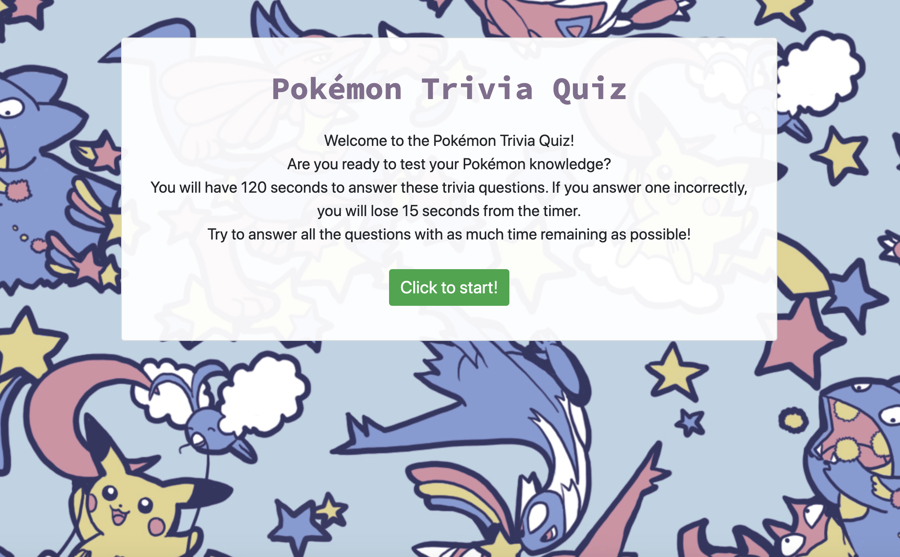
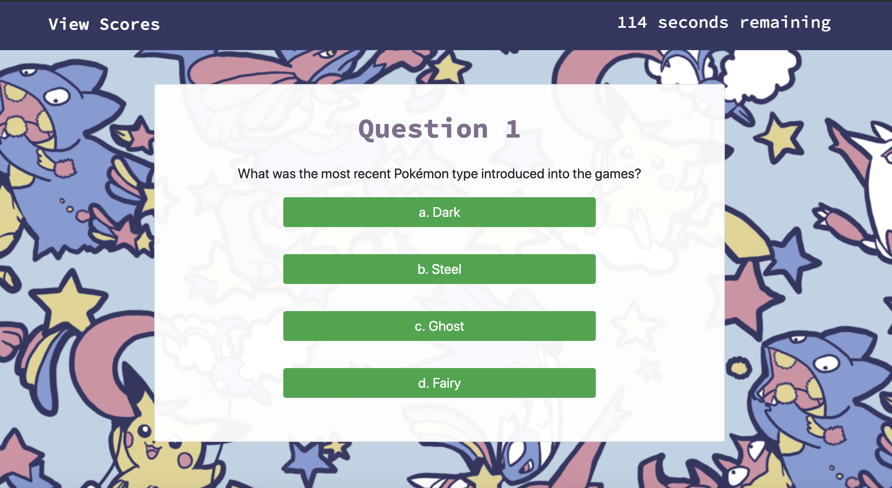
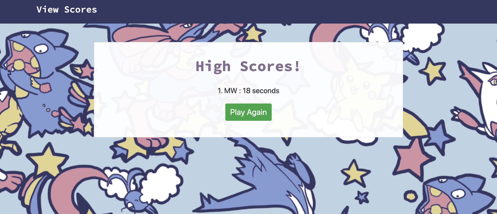

# Pokémon Interactive Quiz

>In order to master JavaScript, it is important to study how to interact with and change different elements on the page using the HTML DOM (Document Object Markup). This project is an interactive quiz utilizing multiple JavaScript functions to change how much time the user has left to complete the quiz, how interactive elements are displayed on the page, and even store the user's initials and answers to the console!

## General Information

This is a Pokémon quiz that asks users various questions about Pokémon to test their knowledge. When users click the "Start" button, a timer of 120 seconds starts, and users are taken to their first quiz question. If they answer the question correctly, they are notified and taken to the next question. However, if they answer incorrectly, 15 seconds will be deducted from the timer, and they are notified they answered incorrectly. Whether users answer correctly or incorrectly, they will be taken to the next question regardless.

Once the timer reaches 0, or when the quiz has cycled through all 10 questions, the timer will stop and the quiz will end. Users will be notified of their score, and they will be prompted to submit their initials and save their score. When they submit their initials, their initials and score will be saved to the Local Storage. Once users have submitted their score, they can view other players' high scores by clicking the "View High Scores" button, or start the quiz again in hopes of getting a better outcome by clicking the "Play Again" button. 

## Screenshots

Starting Screen

  

Sample Question

  
Ending screen: in this case, the visitor ran out of time

  

High Scores list

## Special Thanks

Special thanks to UW Coding Boot Camp for answering my extensive questions, and an extra special thanks to Ari for coming up with all the Pokémon questions!